# Red-Hat-System-Administration
# Lab 2
1. Create a user account with the following attribute
username: islam
Fullname/comment: Islam Askar
Password: islam

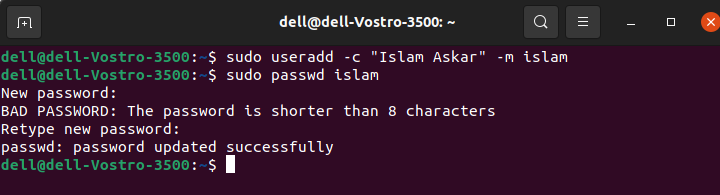

2. Create a user account with the following attribute
Username: baduser
Full name/comment: Bad User
Password: baduser

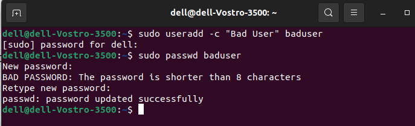

3. Create a supplementary (Secondary) group called pgroup with group ID of 30000

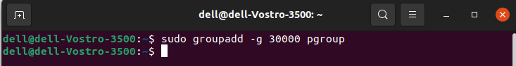

4. Create a supplementary group called badgroup

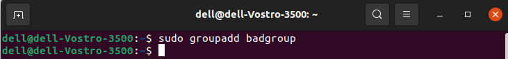

5. Add islam user to the pgroup group as a supplementary group

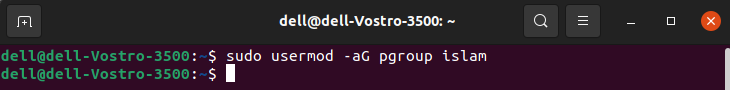

6. Modify the password of islam's account to password

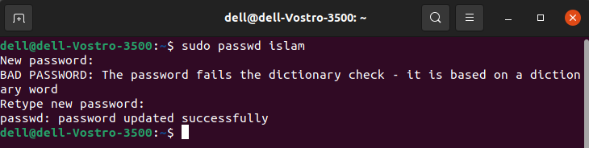

7. Modify islam's account so the password expires after 30 days

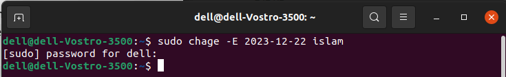

8. Lock bad user account so he can't log in

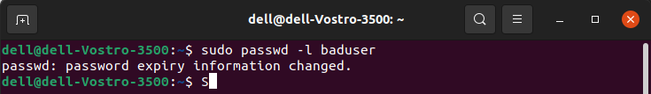

9. Delete bad user account

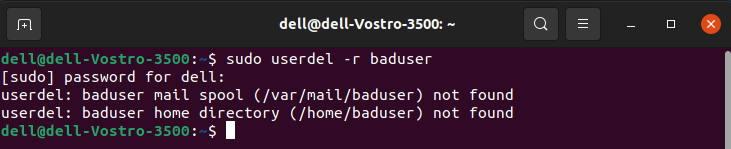

10. Delete the supplementary group called badgroup.

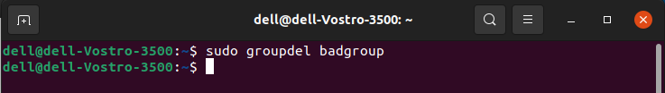

13. Create a folder called myteam in your home directory and change its permissions to
read only for the owner.

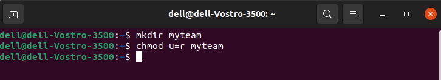

14. Log out and log in by another user
15. Try to access (by cd command) the folder (myteam)

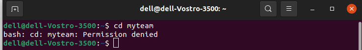

16. Using the command Line
Change the permissions of oldpasswd file to give owner read and write
permissions and for group write and execute and execute only for the others
(using chmod in 2 different ways)

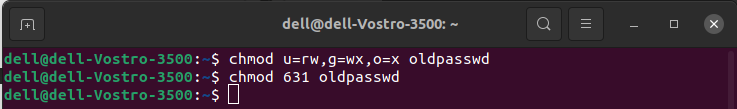

Change your default permissions to be as above.

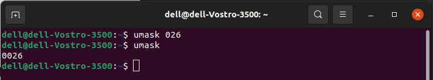

What is the maximum permission a file can have, by default when it is just
created? And what is that for directory.

for file : 666 (read & write) for owner, group, and others.
 
for directory : 777 (read & write & execute)  for owner, group, and others.

Change your default permissions to be no permission to everyone then create a
directory and a file to verify.

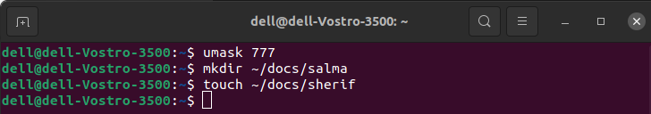

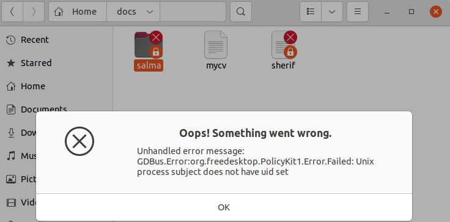

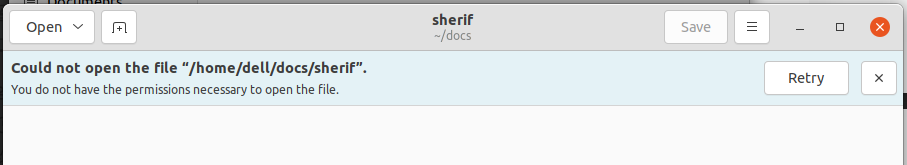

17. What are the minimum permission needed for:

Copy a directory (permission for source directory and permissions for target
parent directory)

-> source directory : read and execute
 
-> target parent directory : write

Copy a file (permission for source file and and permission for target parent
directory)

-> source directory : read
 
-> target parent directory : write

Delete a file

-> write

Change to a directory

-> execute

List a directory content (ls command)

-> read

View a file content (more/cat command)

-> read 

Modify a file content

-> write

18. Create a file with permission 444. Try to edit in it and to remove it? Note what
happened.

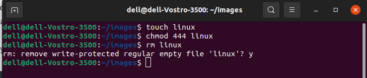
 
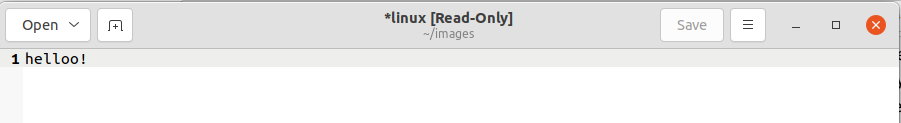

19. What is the difference between the “x” permission for a file and for a
directory?

for a file: execute (x): allows the file to be executed as a program or script.
 
for a directory: execute (x): Allows accessing and traversing the directory.

