# Red-Hat-System-Administration
# Lab 3
Edit in your profile to display date at login and change your prompt permanently.
1. Using vi write your CV in the file mycv. Your CV should include your name, age, school,
college, experience,...

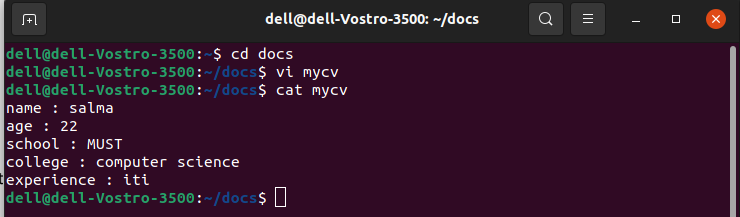

2. Open mycv file using vi command then: Without using arrows state how to:

a. Move the cursor down one line at time.

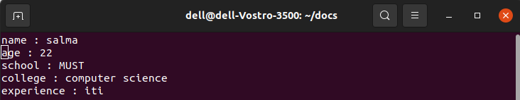

b. Move the cursor up one line at time.

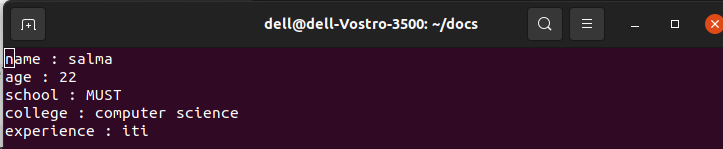

c. Search for word age

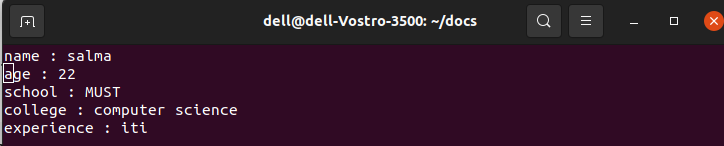

d. Step to line 5 (assuming that you are in line 1 and file is more than 5 lines).

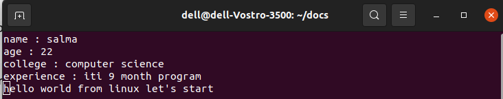

e. Delete the line you are on and line 5.

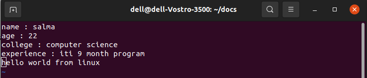

f. How to step to the end of line and change to writing mode in one-step.

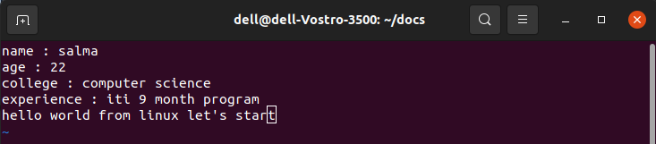

3. List the available shells in your system.

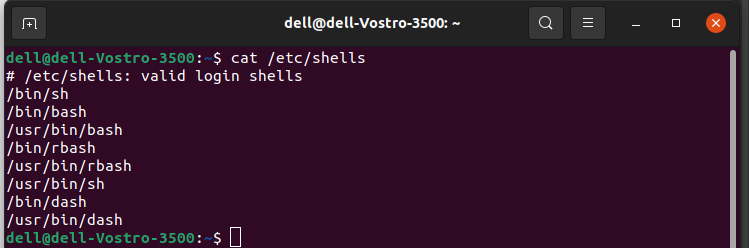

4. List the environment variables in your current shell.

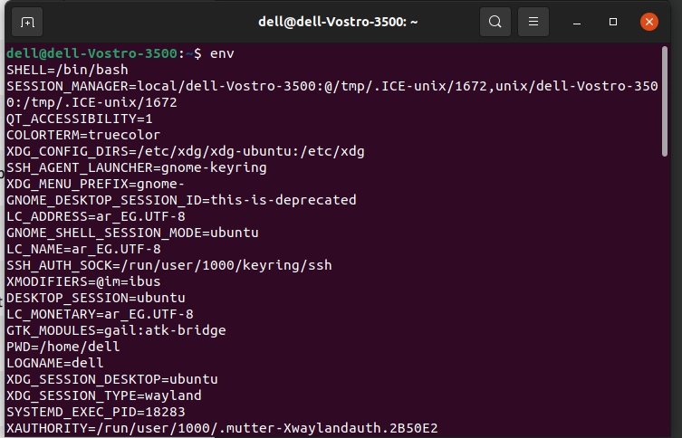

5. List all of the environment variables for the bash shell.

6. What are the commands that list the value of a specific variable?

echo $variable_name

7. Display your current shell name.

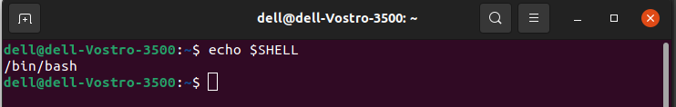

8. State the initialization files of: sh, ksh, bash.

9. Edit in your profile to display date at login and change your prompt permanently.

10.Execute the following command :
echo \ then press enter
What is the purpose of \ ?
Notice the prompt ”>” what is that? and how can you change it from “>” to “:”.

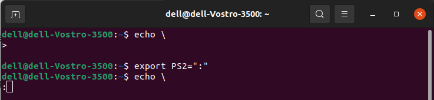

11.Create a Bash shell alias named ls for the “ls –l” command

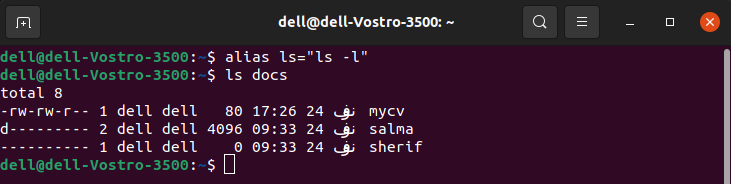
