# Red-Hat-System-Administration
# Lab 5

1. Compress a file by compress, gzip, zip commands and decompress it again. State the
differences between compress and gzip commands.

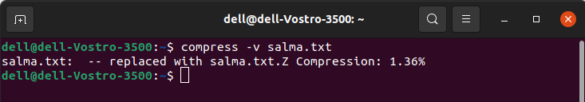

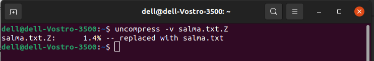

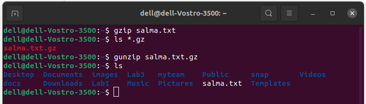

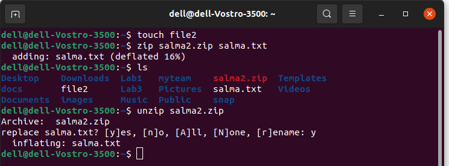

2. What is the command used to view the content of a compressed file.

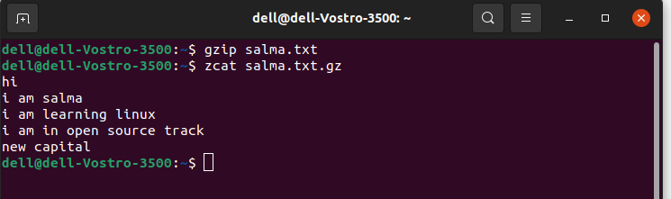

3. Backup /etc directory using tar utility.

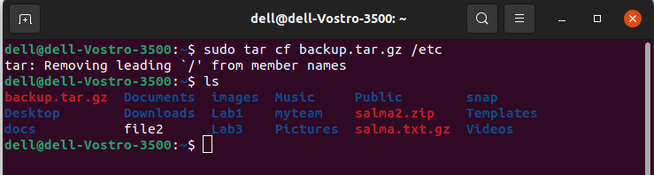

4. Starting from your home directory, find all files that were modified in the last two day.

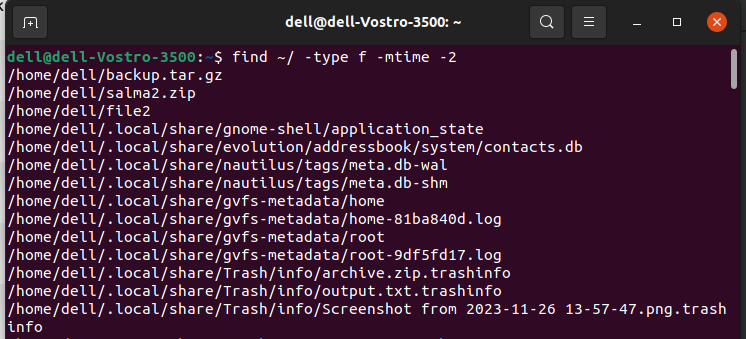

5. Starting from /etc, find files owned by root user.

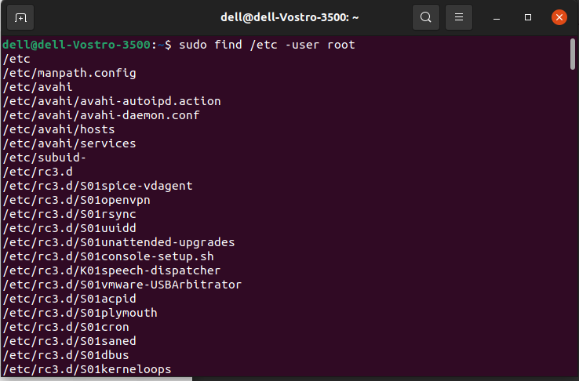

6. Find all directories in your home directory.

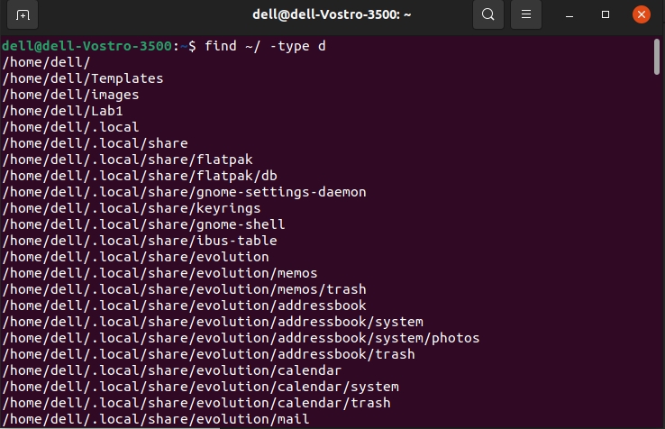

7. Write a command to search for all files on the system that, its name is “.profile”.

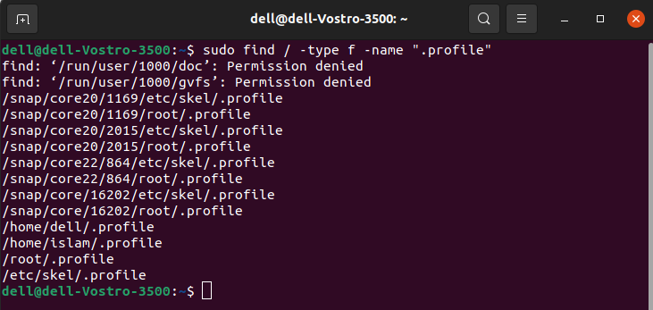

8. Identify the file types of the following: /etc/passwd, /dev/pts/0, /etc, /dev/sda

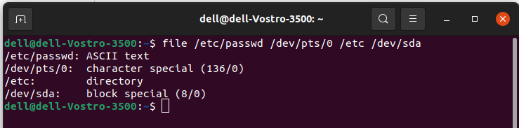

9. List the inode numbers of /, /etc, /etc/hosts.

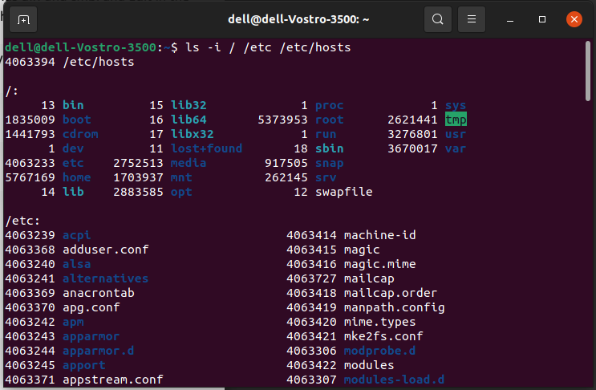

10. Copy /etc/passwd to your home directory, use the commands diff and cmp, and Edit in the
file you copied, and then use these commands again, and check the output.

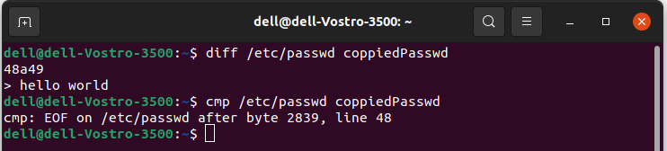

11. Create a symbolic link of /etc/passwd in /boot.

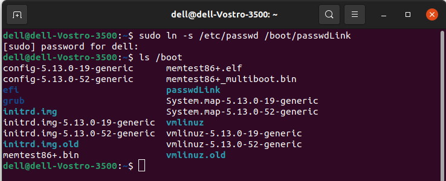

12. Create a hard link of /etc/passwd in /boot. Could you? Why?

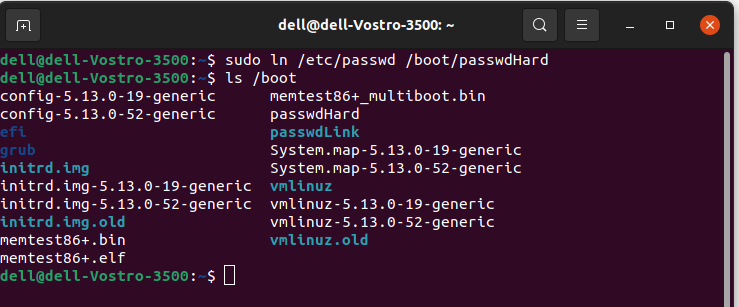
