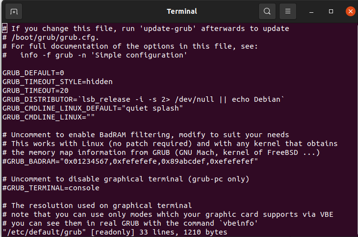

# Lab 6
1. Use systemctl to view the status of all the system services.

2. Change the default run level back to multi-user.target and reboot.

3. Send mail to the root user.

4. Verify that you have received this mail.

5. Use  systemctl utility to stop postfix service

6. 6. Send mail again to the root user.

7. Verify that you have received this mail.

8. Use systemctl utility to start postfix service

9. Verify that you have received this mail.

10. Edit in the GRUB2 configuration file and change the timeout variable equal 20 seconds.

11.  Edit in the GRUB2 configuration file and change your default operating system

12. You want to know some information about the status of the system every ten minutes today between the hours of  8:00 AM and 5:00 PM. to help investigate some performance issues you have been having. You suspect it might be memory related and want to keep an eye on those resources.

13. Use mail as the root user to check for e-mail from the cron jobs you have scheduled.

14. How could you send the output from these cron jobs to another e-mail address (the manager user)?
15. Use mail as the manager user to check for e-mail from the cron jobs you have scheduled.
17. Attempt to run the command gnuplot. You should find that it is not
installed.

18. Search for the plotting packages.

19. Find out more information about the gunuplot package.

20. Install the gnuplot package.

21. Attempt to remove the gnuplot package, but say no
How many packages would be removed

Using rpm
22. List all installed packages in your system.
23. View the files in the initscripts package

=> yum installed list | grep 'initscripts'

24. Get general information about bash rpm.
25. Have the files from the pam package changed since it was
installed.
26. Which installed packages have gnome in their names?

=> yum list installed | grep 'gnome'

27. Install any uninstalled package from RH Enterprise Linux cds
28. Search for software resemble the Photoshop software other than
Gimp and install it.
29. Create the file /etc/yum.repos.d/cdrom.repo to enable install from
the iso from the iso of Red Hat.
30. Try to install any package from the new repository
